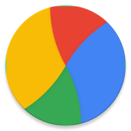
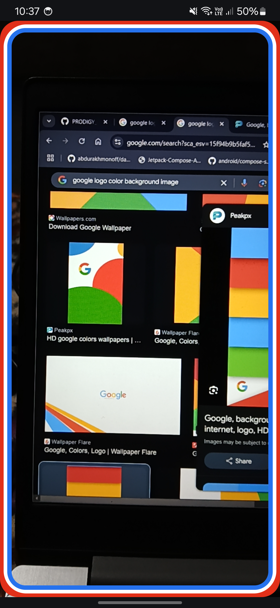
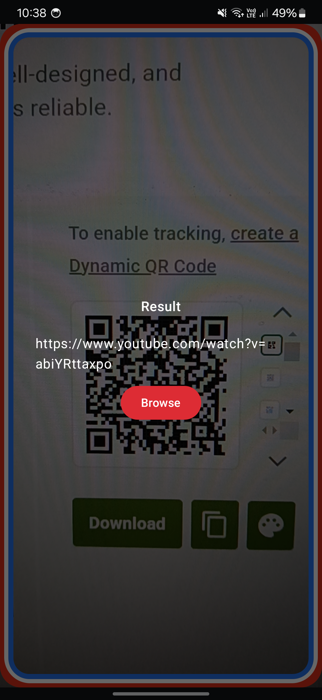

  
  <h3 align="center">QR Scanner App</h3>

QR Scanner App using ML Kit Barcode Scanning API and UI using Jetpack Compose

## Screenshots

  
  

<a href="https://drive.google.com/file/d/1f8OpAFNreawmnZASTC3d-7kDaMZuE7zr/view?usp=sharing" >  Download App</a>